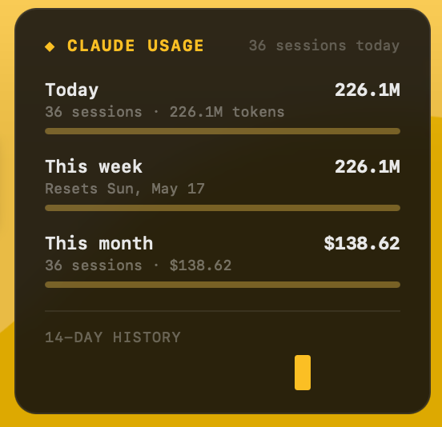

# Claude Usage Tracker

An [Übersicht](https://tracesof.net/uebersicht/) widget that tracks your [Claude Code](https://claude.ai/code) usage and displays token counts, cost, and live usage percentages — with color-coded alerts as you approach your limits.



## Features

- **Today / this week / this month** usage bars
- **14-day spending sparkline**
- **Live usage %** matching the Claude.ai Settings → Usage panel (session and weekly), with reset countdown timers
- Color-coded alerts (green → yellow → orange → red) as limits approach
- Graceful fallback to local data when live % is unavailable

## Requirements

- macOS
- [Übersicht](https://tracesof.net/uebersicht/)
- Claude Code CLI
- Python 3

## Install

```sh
git clone https://github.com/jake-fowler-lego-nerd/claude-usage-tracker
cd claude-usage-tracker
chmod +x install.sh
./install.sh
```

The installer will:
1. Copy scripts to `~/.claude-usage/`
2. Symlink the widget into Übersicht's widgets folder
3. Add a `Stop` hook to `~/.claude/settings.json`
4. Offer to install `browser-cookie3` for live usage %

Then refresh Übersicht (status bar menu → **Refresh All Widgets**).

## How it works

### Logging

A Claude Code `Stop` hook fires at the end of every session. It reads the session transcript, sums token usage across all API calls, computes cost, and appends one line to `~/.claude-usage/log.jsonl`:

```json
{"timestamp":"2026-05-11T22:00:00Z","session_id":"...","models":["claude-sonnet-4-6"],"cost_usd":0.42,"input_tokens":1200,"output_tokens":8400,"cache_creation_input_tokens":11000,"cache_read_input_tokens":320000}
```

### Widget

The widget refreshes every 60 seconds. `aggregate.py` reads the log, computes today/week/month totals, and optionally fetches live percentages from claude.ai. The result is rendered as three usage bars with a sparkline.

## Operating modes

### Mode 1 — Live % (recommended)

When `browser-cookie3` is installed and Chrome is signed in to claude.ai, the widget fetches live session and weekly usage percentages directly from Claude's API — the same data shown on the Settings → Usage panel.

- **Current session** bar shows `X% used` with a countdown to reset
- **This week** bar shows `X% used` with the reset date
- **This month** bar shows cost vs. your `monthly_budget_usd`

### Mode 2 — Local data only

Without `browser-cookie3`, the widget falls back to aggregated local data from the log file. Session and weekly bars show token counts and cost instead of percentages. You can still set a `monthly_budget_usd` in `config.json` to see a percentage bar for the month.

## Live usage % setup

The live percentage feature reads your Chrome session cookie for claude.ai using [`browser-cookie3`](https://github.com/borisbabic/browser_cookie3). No credentials are stored or transmitted — it reads the same cookie Chrome already has.

**Requirements:**
- Google Chrome, signed in to claude.ai
- `browser-cookie3` Python package

**Install `browser-cookie3`:**

```sh
pip3 install browser-cookie3
```

Or with Homebrew Python:

```sh
/opt/homebrew/bin/pip3 install browser-cookie3
```

**First run:** macOS will prompt for Keychain access so `browser-cookie3` can decrypt Chrome's cookie store. Click **Allow**.

**To disable live %:** uninstall the package (`pip3 uninstall browser-cookie3`) or simply don't install it. The widget continues working in local-data mode.

## Configuration

Create `~/.claude-usage/config.json` to set limits:

```json
{
  "monthly_budget_usd":  100,
  "weekly_token_limit":  233000000
}
```

All fields are optional.

| Field | Description |
|-------|-------------|
| `monthly_budget_usd` | Enables a % bar for monthly spending |
| `weekly_token_limit` | Used to back-calculate % when live data is unavailable |
| `daily_budget_usd` | Daily spending limit (future use) |
| `daily_token_limit` | Daily token limit (future use) |

### Finding your token limit

Anthropic doesn't publish exact limits, but you can back-calculate from the Usage panel:

1. Go to **claude.ai → Settings → Usage** and note your current weekly % used
2. Get your current week's token count:
   ```sh
   python3 ~/.claude-usage/aggregate.py | python3 -c \
     "import json,sys; d=json.load(sys.stdin); print(d['week']['total_tokens'])"
   ```
3. Divide: `week_tokens ÷ (pct_used / 100)` = your approximate limit

### Alert colors

| Color | Threshold |
|-------|-----------|
| Green | < 75% |
| Yellow | 75–90% |
| Orange | 90–100% |
| Red | ≥ 100% |

## Pricing

Costs are computed from the session transcript using these rates (per million tokens):

```python
PRICING = {
    "claude-opus-4-7":   {"input": 15.00, "output": 75.00, "cache_write": 18.75, "cache_read": 1.50},
    "claude-sonnet-4-6": {"input":  3.00, "output": 15.00, "cache_write":  3.75, "cache_read": 0.30},
    "claude-haiku-4-5":  {"input":  0.80, "output":  4.00, "cache_write":  1.00, "cache_read": 0.08},
}
```

Update `log-usage.py` if Anthropic changes pricing.

## Files

```
claude-usage-tracker/
  ClaudeUsage.widget/
    index.jsx        # Übersicht widget UI
    aggregate.py     # reads log, outputs JSON (copied to ~/.claude-usage/)
    run.sh           # finds a Python with browser-cookie3, falls back to system Python
  log-usage.py       # Claude Code Stop hook (copied to ~/.claude-usage/)
  install.sh         # one-command setup
```

After install, the active copies are in `~/.claude-usage/`:

```
~/.claude-usage/
  aggregate.py       # aggregation script
  run.sh             # Python finder script
  log-usage.py       # Stop hook
  log.jsonl          # usage log (auto-created)
  config.json        # optional: your limits
```

## Troubleshooting

**Widget shows "parse error" or blank** — Refresh Übersicht. If it persists, run the script manually:
```sh
sh ~/.claude-usage/run.sh
```

**Live % shows 0% or falls back to local data** — Ensure Chrome is open and signed in to claude.ai, then refresh. On first run, approve the Keychain prompt. Check that `browser-cookie3` is installed for the Python that runs `run.sh`:
```sh
/opt/homebrew/bin/python3 -c "import browser_cookie3; print('ok')"
```

**Sessions not being logged** — Verify the Stop hook is in `~/.claude/settings.json`:
```json
{
  "hooks": {
    "Stop": [{"matcher": "", "hooks": [{"type": "command", "command": "python3 /Users/YOU/.claude-usage/log-usage.py"}]}]
  }
}
```

**Wrong Python path in hook** — The hook command uses whatever `python3` is on your PATH at install time. If you move Python later, re-run `install.sh`.
